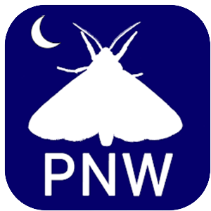
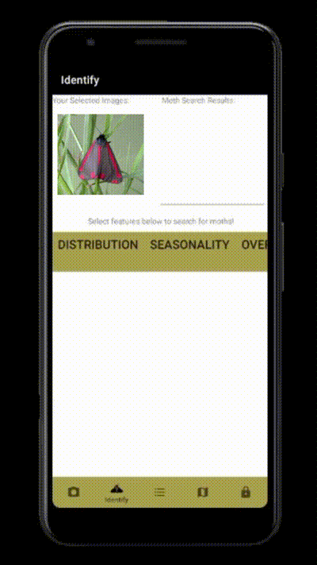
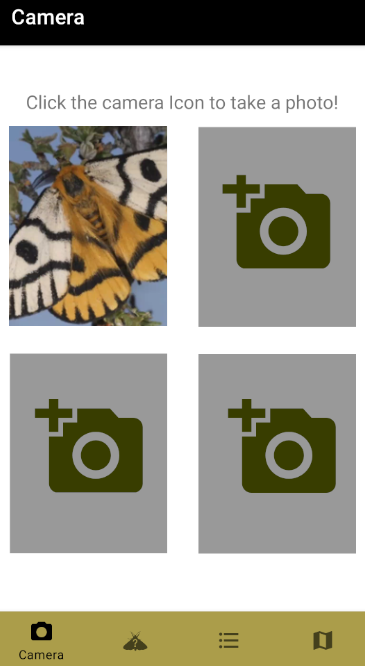
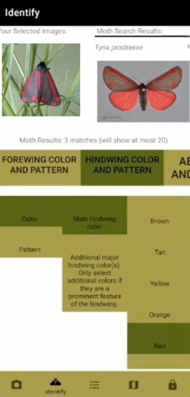
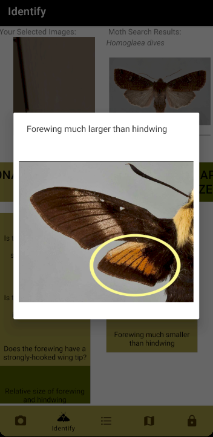
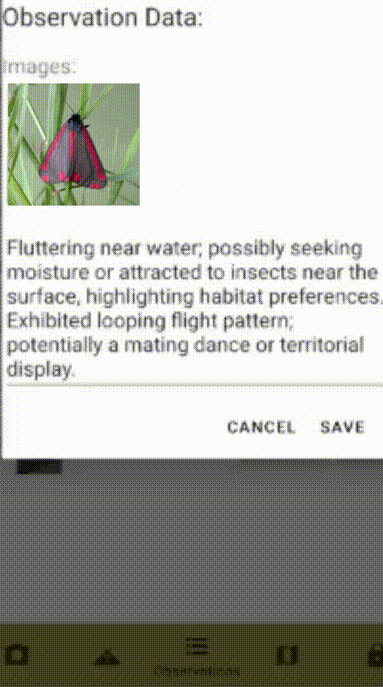
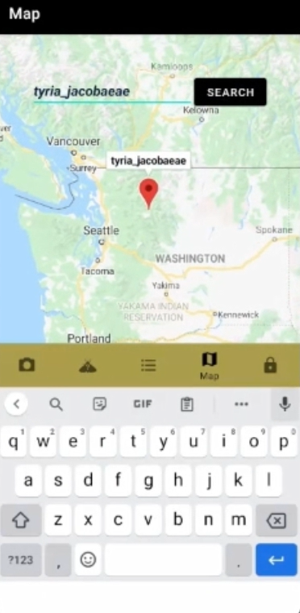

<!-- Improved compatibility of back to top link: See: https://github.com/othneildrew/Best-README-Template/pull/73 -->
<a name="readme-top"></a>


<!-- PROJECT LOGO -->
<br />
<div align="center">
  <a href="https://github.com/jordanbirnel/mothApp">
    
  </a>

<h3 align="center">PNWMoths Mobile App</h3>

  <p align="center">
    An open source repo for the PNWMoths mobile application, used to identify and collect data on moths among 1200+ species in the PNW!
    <br />
    <a href="https://github.com/jordanbirnel/mothApp"><strong>Explore the docs »</strong></a>
    <br />
    <br />
    <a href="https://github.com/jordanbirnel/MothApp/releases/download/demo/PNWMoths-demo.apk">Get Demo APK</a>
    ·
    <a href="https://github.com/jordanbirnel/mothApp/issues">Report Bug</a>
    ·
    <a href="https://github.com/jordanbirnel/mothApp/issues">Request Feature</a>
  </p>
</div>


<!-- TABLE OF CONTENTS -->
<details>
  <summary>Table of Contents</summary>
  <ol>
    <li>
      <a href="#about-the-project">About The Project</a>
      <ul>
        <li><a href="#built-with">Built With</a></li>
      </ul>
    </li>
    <li><a href="#demo">Demo</a></li>
    <li>
      <a href="#getting-started">Getting Started</a>
      <ul>
        <li><a href="#prerequisites">Prerequisites</a></li>
        <li><a href="#installation">Installation</a></li>
      </ul>
    </li>
    <li><a href="#usage">Usage</a></li>
    <li><a href="#roadmap">Roadmap</a></li>
    <li><a href="#contributing">Contributing</a></li>
    <li><a href="#license">License</a></li>
    <li><a href="#contact">Contact</a></li>
    <li><a href="#acknowledgments">Acknowledgments</a></li>
  </ol>
</details>


<!-- ABOUT THE PROJECT -->
## About The Project
<div align="center">
  <a href="https://github.com/jordanbirnel/mothApp">
    
  </a>
  <br>
  </div>

This repo contains code for the PNWMoths mobile application, which I developed as part of a team on as a volunteer for the [PNWMoths](http://pnwmoths.biol.wwu.edu/) project, an Institutional Partnership Between many universities, museums, and associations in the Pacific Northwest.
Since the official release unfortunately has not received updates or support since its initial launch in 2021, I have contributed an open-source version to this repository.

Here's why:
* An original goal of the project was to open source the code for the application.
* I am hoping that this repo will garner interest in open-source contributions, or inspires other useful contributions to the PNWMoths project.


<p align="right">(<a href="#readme-top">back to top</a>)</p>


### Built With

* [![Android Studio][AndroidStudio]][AndroidStudio-url]
* [![Firebase][Firebase.google.com]][Firebase-url]
* [![Java][Java.com]][Java-url]

<p align="right">(<a href="#readme-top">back to top</a>)</p>


<!-- Demo -->
## Demo
Our project provides a demo version of the application for users interested in experiencing its features without needing to compile the code. 
This demo APK is available through GitHub Releases.
Follow these steps to download and install the demo APK:


#### Download the APK

Download the APK [here](https://github.com/jordanbirnel/MothApp/releases/download/demo/PNWMoths-demo.apk). 

#### Install the APK on Your Android Device

Before installing, ensure that your device allows installation from unknown sources. This setting can typically be found in Settings > Security or Settings > Apps & notifications > Special app access > Install unknown apps. Enable this option for your browser or file manager.

Once the APK has downloaded, open it on your device to start the installation process. Follow the prompts to complete the installation.

#### Launch the App

After installation, open the app like you would with any other installed application on your device. You're now ready to explore the demo!

Note: The demo APK is intended for evaluation and testing purposes. It may not include all the features of the final product and may contain bugs. If you encounter any issues or have feedback, please feel free to open an issue on our GitHub repository.
<!-- GETTING STARTED -->
## Getting Started

This guide will help you set up the PNWMoths Mobile App project on your local machine for development and testing purposes.
 Follow these steps to get your development environment up and running.

### Prerequisites

Android Studio
JDK (Java Development Kit)
Make sure you have Android Studio and JDK installed on your system.
If not, you can download Android Studio
from [here](https://developer.android.com/studio) and JDK from
[here](https://www.oracle.com/java/technologies/downloads/).


### Installation

1. Clone the Repository
Begin by cloning the repository to your local machine. Open a terminal window and execute the following command:
```sh
   git clone https://github.com/your_username_/Project-Name.git
   ```

2. Open the Project in Android Studio

Launch Android Studio and select "Open an Existing Project" from the initial screen. Navigate to the directory where you cloned the repository and open it.

3. Firebase API Key Configuration
For read-only access to the Firebase database necessary for the app, you will need a Firebase API key.
 Please <a href="#contact">contact</a> the repository owner to request this key. Once you have received the key, you will be provided with a google-services.json file. Place this file in your app's module directory.

4. Configure Google Maps API Key
Obtain a Google Maps API key by following the instructions [here](https://developers.google.com/maps/documentation/android-sdk/get-api-key).
 Once you have your API key, add it to your local.properties file in the root of your project like so:
 ```js
MAPS_API_KEY="{your_key_here}"
```
This key will be used by your application to access Google Maps services.

After completing these steps, you should be ready to build and run the application in Android Studio.
 Ensure that the API keys are correctly placed as per the instructions. If you encounter any issues during setup, please review the project's documentation or reach out for support.

<p align="right">(<a href="#readme-top">back to top</a>)</p>


<!-- USAGE EXAMPLES -->
## Usage

### Photo Capture

Capture images of moths you find in the wild, which can be used to compare with other moths in the identification page.

### Identification
<div>


</div>
Utilize the identification key to filter moth species by observed features.
Compare your moth photos with search results to identify the species. 
Save identified moths as observations with images, location, and data recording.

### Observations

This page allows you to review observations you have made on moths that you have found. 
You can upload a moth observation to the backend of the application, or delete previous observations if you believe they are incorrect. 
In the future, a goal of the PNWMoths project is to have a web app for vetting and recording observations made by students and enthusiasts
in the field.

### Map

This page shows locations of moths found using the app. It allows you to search for specific species you have found using the searchbar at the top.
 And shows where they were seen based on the location data of the observation saved.

<p align="right">(<a href="#readme-top">back to top</a>)</p>


<!-- ROADMAP -->
## Roadmap

- [x] Add Modifiable Identification Key to backend
- [x] Add upload features for Moth observations to mobile backend
- [ ] Add process to vet observations by experts and upload to PNWMoths site

See the [open issues](https://github.com/jordanbirnel/mothApp/issues) for a full list of proposed features (and known issues).

<p align="right">(<a href="#readme-top">back to top</a>)</p>


<!-- CONTRIBUTING -->
## Contributing

Contributions are what make the open source community such an amazing place to learn, inspire, and create. Any contributions you make are **greatly appreciated**.

If you have a suggestion that would make this better, please fork the repo and create a pull request. You can also simply open an issue with the tag "enhancement".
Don't forget to give the project a star! Thanks again!

1. Fork the Project
2. Create your Feature Branch (`git checkout -b feature/AmazingFeature`)
3. Commit your Changes (`git commit -m 'Add some AmazingFeature'`)
4. Push to the Branch (`git push origin feature/AmazingFeature`)
5. Open a Pull Request

<p align="right">(<a href="#readme-top">back to top</a>)</p>


<!-- LICENSE -->
## License

Distributed under the MIT License. See `LICENSE.txt` for more information.

<p align="right">(<a href="#readme-top">back to top</a>)</p>


<!-- CONTACT -->
## Contact

Jordan Birnel - jordanbirnel@outlook.com

PNWMoths site contact - pnwmoths@gmail.com

Project Link: [https://github.com/jordanbirnel/mothApp](https://github.com/jordanbirnel/mothApp)

<p align="right">(<a href="#readme-top">back to top</a>)</p>


<!-- ACKNOWLEDGMENTS -->
## Acknowledgments

* [http://pnwmoths.biol.wwu.edu/](http://pnwmoths.biol.wwu.edu/)

<p align="right">(<a href="#readme-top">back to top</a>)</p>


<!-- MARKDOWN LINKS & IMAGES -->
<!-- https://www.markdownguide.org/basic-syntax/#reference-style-links -->
[contributors-shield]: https://img.shields.io/github/contributors/github_username/repo_name.svg?style=for-the-badge
[contributors-url]: https://github.com/github_username/repo_name/graphs/contributors
[forks-shield]: https://img.shields.io/github/forks/github_username/repo_name.svg?style=for-the-badge
[forks-url]: https://github.com/github_username/repo_name/network/members
[stars-shield]: https://img.shields.io/github/stars/jordanbirnel/mothApp.svg?style=for-the-badge
[stars-url]: https://github.com/github_username/repo_name/stargazers
[issues-shield]: https://img.shields.io/github/issues/github_username/repo_name.svg?style=for-the-badge
[issues-url]: https://github.com/github_username/repo_name/issues
[license-shield]: https://img.shields.io/github/license/github_username/repo_name.svg?style=for-the-badge
[license-url]: https://github.com/github_username/repo_name/blob/master/LICENSE.txt
[linkedin-shield]: https://img.shields.io/badge/-LinkedIn-black.svg?style=for-the-badge&logo=linkedin&colorB=555
[linkedin-url]: https://linkedin.com/in/linkedin_username
[product-screenshot]: images/mothdemo.gif
[Next.js]: https://img.shields.io/badge/next.js-000000?style=for-the-badge&logo=nextdotjs&logoColor=white
[Next-url]: https://nextjs.org/
[React.js]: https://img.shields.io/badge/React-20232A?style=for-the-badge&logo=react&logoColor=61DAFB
[React-url]: https://reactjs.org/
[Vue.js]: https://img.shields.io/badge/Vue.js-35495E?style=for-the-badge&logo=vuedotjs&logoColor=4FC08D
[Vue-url]: https://vuejs.org/
[Angular.io]: https://img.shields.io/badge/Angular-DD0031?style=for-the-badge&logo=angular&logoColor=white
[Angular-url]: https://angular.io/
[Svelte.dev]: https://img.shields.io/badge/Svelte-4A4A55?style=for-the-badge&logo=svelte&logoColor=FF3E00
[Svelte-url]: https://svelte.dev/
[Laravel.com]: https://img.shields.io/badge/Laravel-FF2D20?style=for-the-badge&logo=laravel&logoColor=white
[Laravel-url]: https://laravel.com
[Bootstrap.com]: https://img.shields.io/badge/Bootstrap-563D7C?style=for-the-badge&logo=bootstrap&logoColor=white
[Bootstrap-url]: https://getbootstrap.com
[JQuery.com]: https://img.shields.io/badge/jQuery-0769AD?style=for-the-badge&logo=jquery&logoColor=white
[JQuery-url]: https://jquery.com 
[AndroidStudio]: https://img.shields.io/badge/Android_Studio-3DDC84?style=for-the-badge&logo=android-studio&logoColor=white
[AndroidStudio-url]: https://developer.android.com/studio
[Firebase.google.com]: https://img.shields.io/badge/Firebase-039BE5?style=for-the-badge&logo=Firebase&logoColor=white
[Firebase-url]: https://firebase.google.com/
[Java.com]: https://img.shields.io/badge/java-%23ED8B00.svg?style=for-the-badge&logo=openjdk&logoColor=white
[Java-url]: https://www.java.com/
